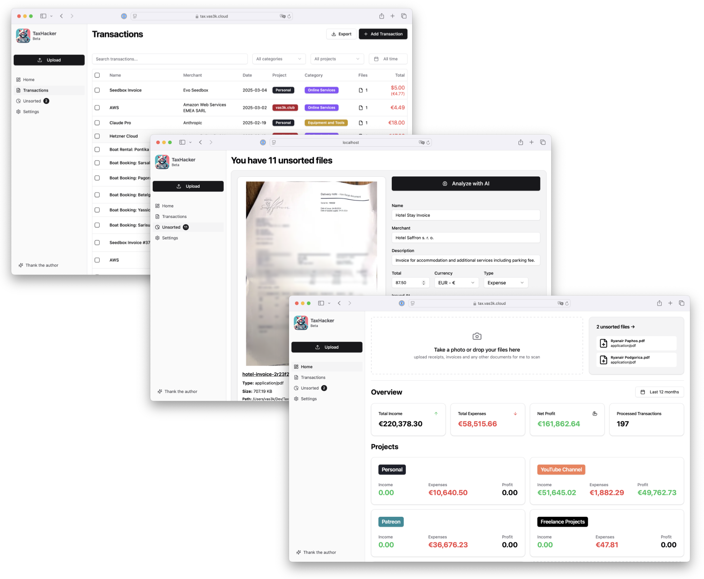
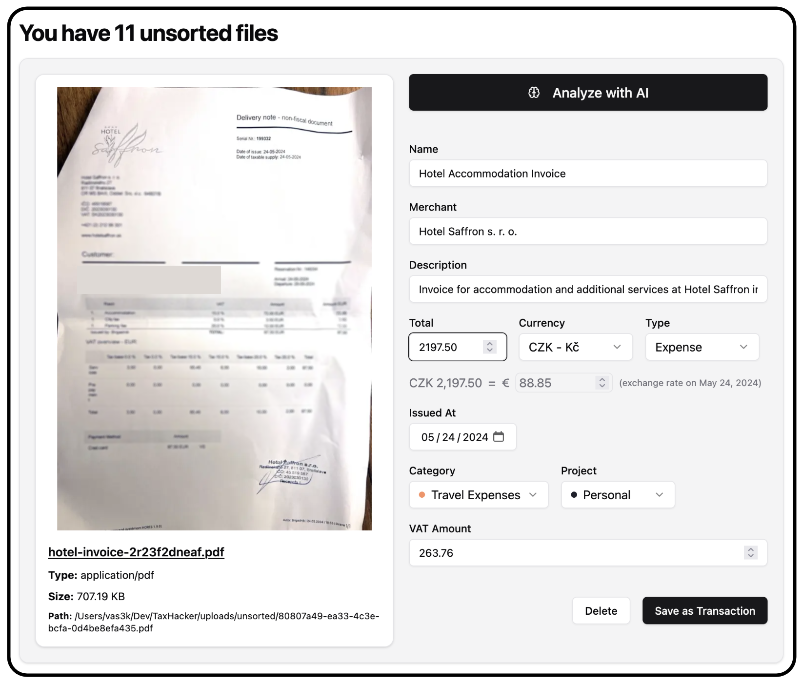
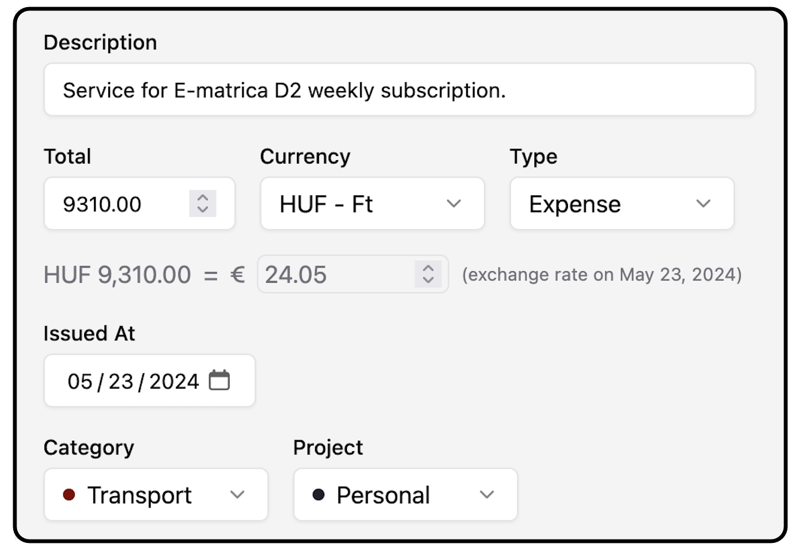
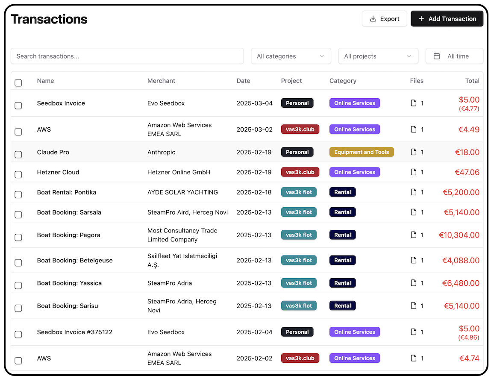
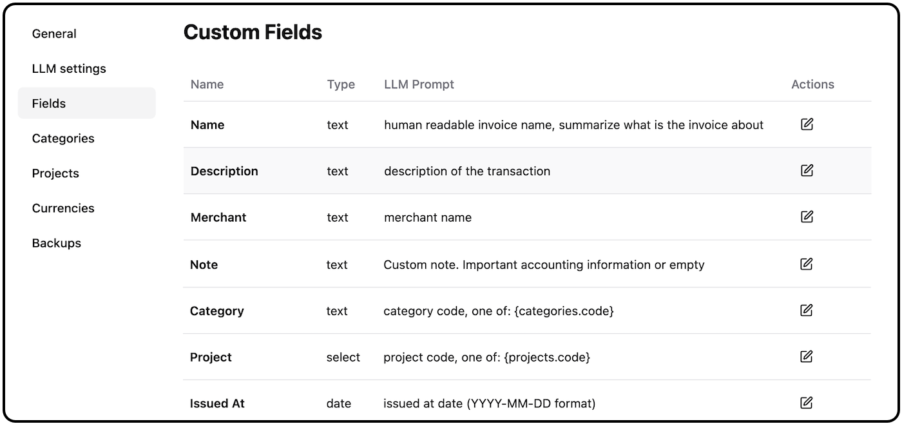
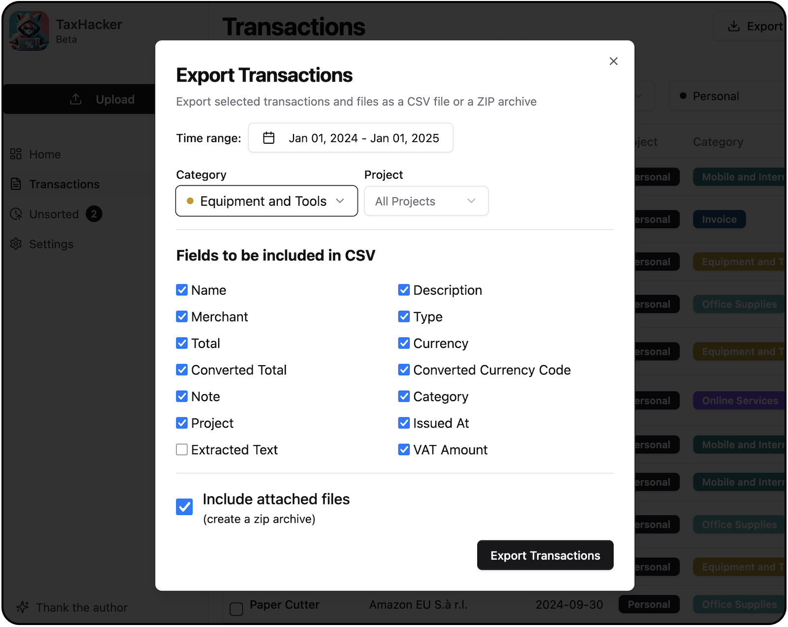
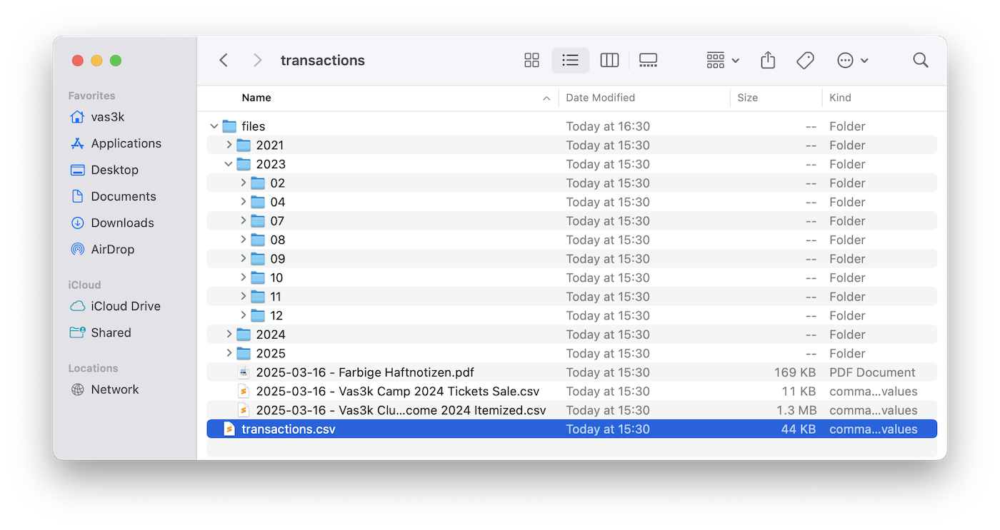

<div align="center"><a name="readme-top"></a>


# TaxHacker

I'm a small self-hosted accountant app that can help you deal with invoices, receipts and taxes with power of GenAI.<br/><br/>

[](https://github.com/vas3k/TaxHacker/stargazers)
[](https://github.com/vas3k/TaxHacker/blob/main/LICENSE)
[](https://github.com/vas3k/TaxHacker/issues)
[](https://vas3k.com/donate/)

**Share TaxHacker**

[](https://x.com/intent/tweet?text=Check%20out%20TaxHacker%20-%20an%20AI-powered%20assistant%20that%20helps%20you%20manage%20receipts%2C%20checks%2C%20and%20invoices%20with%20ease.&url=https%3A%2F%2Fgithub.com%2Fvas3k%2FTaxHacker)
[](https://www.linkedin.com/sharing/share-offsite/?url=https%3A%2F%2Fgithub.com%2Fvas3k%2FTaxHacker)
[](https://www.reddit.com/submit?title=Check%20out%20TaxHacker%20-%20an%20AI-powered%20assistant%20that%20helps%20you%20manage%20receipts%2C%20checks%2C%20and%20invoices%20with%20ease.&url=https%3A%2F%2Fgithub.com%2Fvas3k%2FTaxHacker)

</div>

## 👋🏻 Getting Started

TaxHacker is a self-hosted accounting app for freelancers and small businesses who want to save time and automate expences and income tracking with power of GenAI. It can recognise uploaded photos, receipts or PDFs and extract important data (e.g. name, total amount, date, merchant, VAT) and save it as structured transactions to a table. You can also create your own custom fields to extract with your LLM prompts.

It supports automatic currency conversion on a day of transaction. Even for crypto!

Built-in system of filters, support for multiple projects, import-export of transactions for a certain time (along with attached files) and custom categories, allows you to simplify reporting and tax filing.



> \[!NOTE]
>
> TaxHacker is a single-user app. SaaS or Electron version will probably be developed in the future if anyone is interested.

> \[!IMPORTANT]
>
> This project is still at a very early stage. Use it at your own risk! **Star Us** to receive notifications about new bugfixes and features from GitHub ⭐️

## ✨ Features

### `1` Upload photos or documents to analyze with LLM



Take a photo on upload or a PDF and TaxHacker will automatically recognise, categorise and store transaction information.

- Upload multiple documents and store in “unsorted” until you get the time to sort them out by hand or with an AI
- Use LLM to extract key information like date, amount, and vendor
- Automatically categorize transactions based on its content
- Store everything in a structured format for easy filtering and retrieval
- Organize your documents by a tax season

TaxHacker recognizes a wide variety of documents including store receipts, restaurant bills, invoices, bank checks, letters, even handwritten receipts.

### `2` Multi-currency support with automatic conversion (even for crypto)



TaxHacker automatically converts foreign currencies and even knows the historical exchange rates on the invoice date.

- Automatically detect currency in your documents
- Convert it to your base currency
- Historical exchange rate lookup for past transactions
- Support for over 170 world currencies and 14 popular cryptocurrencies (BTC, ETC, LTC, DOT, etc)!

### `3` Customize any LLM prompt



You can customize LLM Prompts for built-in fields, categories, and projects, as well as modify global templates in the application settings. This allows to customize the quality of recognizing specific things to your specific use-cases.

- General prompt template is configurable is settings
- Create custom extraction rules for your specific needs
- Adjust field extraction priorities and naming conventions
- Fine-tune the AI for your industry-specific documents

The whole extraction process is under your contoll all the time!

### `4` Create custom fields, projects, categories



Adapt TaxHacker to your specific tracking needs. You can create new fields, projects or categories to extract additional information from documents. For example, if you need to save emails, addresses, and any custom information into separate fields, you can do it. Custom fields will be available when exporting too.

- Create unlimited custom fields for transaction tracking
- Automatically extract custom field data using AI
- Include custom fields in exports and reports
- Create new categories or projects to organise your transactions and filter by them

### `5` Flexible data filtering and export



Once all documents have been uploaded and analyzed, you can view, filter and export your transaction history.

- Filter transactions by time, category, and other features
- Use full-text search by recognized document content
- Export filtered transactions to CSV with attached documents
- Upload your entire income and expense history at the end of the year for your tax advisor to analyze

### `6` Local data storage and self-hosting



## 🛳 Deploying or Self-hosting

TaxHacker can be self-hosted on your own infrastructure for complete control over your data and application environment. We provide a [Docker image](./Dockerfile) and [Docker Compose](./docker-compose.yml) files that makes setting up TaxHacker simple:

```bash
curl -O https://raw.githubusercontent.com/vas3k/TaxHacker/main/docker-compose.yml

docker compose up
```

New docker image is automatically built and published on every new release. You can use specific version tags (e.g. `v1.0.0`) or `latest` for the most recent version.

For more advanced setups, you can adapt Docker Compose configuration to your own needs. The default configuration uses the pre-built image from GHCR, but you can still build locally using the provided [Dockerfile](./Dockerfile) if needed. 

For example:

```yaml
services:
  app:
    image: ghcr.io/vas3k/taxhacker:latest
    ports:
      - "7331:7331"
    environment:
      - NODE_ENV=production
      - UPLOAD_PATH=/app/data/uploads
      - DATABASE_URL=file:/app/data/db.sqlite
    volumes:
      - ./data:/app/data
    restart: unless-stopped
```

### Environment Variables

Configure TaxHacker to suit your needs with these environment variables:

| Variable | Required | Description | Example |
|----------|----------|-------------|---------|
| `UPLOAD_PATH` | Yes | Local directory for uploading files | `./upload` |
| `DATABASE_URL` | Yes | Database file for SQLite | `file:./db.sqlite` |
| `PROMPT_ANALYSE_NEW_FILE` | No | Default prompt for LLM | `Act as an accountant...` |

## ⌨️ Local Development

We use:

- Next.js version 15+ or later
- [Prisma](https://www.prisma.io/) for database models and migrations
- SQLite as a database
- Ghostscript and graphicsmagick libs for PDF files (can be installed on macOS via `brew install gs graphicsmagick`)

Set up a local development environment with these steps:

```bash
# Clone the repository
git clone https://github.com/vas3k/TaxHacker.git
cd TaxHacker

# Install dependencies
npm install

# Set up environment variables
cp .env.example .env
# Edit .env with your configuration

# Initialize the database
npx prisma generate && npx prisma migrate dev

# Seed the database with default data (optional)
npm run seed

# Start the development server
npm run dev
```

Visit `http://localhost:7331` to see your local instance of TaxHacker.

For a production build, instead of `npm run dev` use the following commands:

```bash
# Build the application
npm run build

# Start the production server
npm run start
```

## 🤝 Contributing

Contributions to TaxHacker are welcome and appreciated! Here's how you can help:

- **Bug Reports**: File detailed issues when you encounter problems
- **Feature Requests**: Share your ideas for new features
- **Code Contributions**: Submit pull requests to improve the application
- **Documentation**: Help improve documentation

All work is done on GitHub through issues and pull requests.

[](https://github.com/vas3k/TaxHacker/pulls)

## ❤️ Donate

If TaxHacker has helped you - help us in return! You donations will support maintainance and development. If you find this project valuable for your personal or business use, consider making a donation.

[](https://vas3k.com/donate/)

## 📄 License

TaxHacker is licensed under the MIT License - see the [LICENSE](https://github.com/vas3k/TaxHacker/blob/main/LICENSE) file for details.
